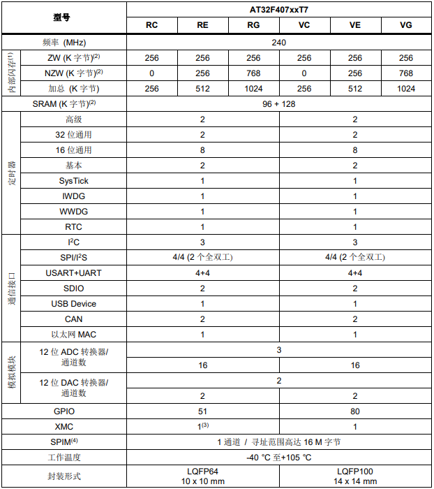

# [AT32F407](https://github.com/SoCXin/AT32F407)

* [arterytek](https://www.arterytek.com/cn/index.jsp): [Cortex-M4](https://github.com/SoCXin/Cortex)
* [L5R4](https://github.com/SoCXin/Level): 240 MHz x 1.25 DMIPS/MHz

## [简介](https://github.com/SoCXin/AT32F407/wiki)

### 关键特性

* Cortex®-M4主频最高 240 MHz
* 高达 16MB 外部 SPI Flash memory 扩展
* 4 x USART + 4 x UART
* 2 x CAN 2.0B
* Crystal-less USB2.0全速接口
* 10/100M以太网MAC：专用DMA和4K SRAM，支持IEEE 1588，MII/RMII接口

### [资源收录](https://github.com/SoCXin/AT32F407)

* [参考资源](src/)
* [参考文档](docs/)
* [参考工程](project/)

### [选型建议](https://github.com/SoCXin)

[AT32F407](https://github.com/SoCXin/AT32F407) 以太网口和多串口配置十分适合网关类通信产品开发，对标产品为STM32F107/GD32F107系列。

### [探索芯世界 www.SoC.xin](http://www.SoC.Xin)
